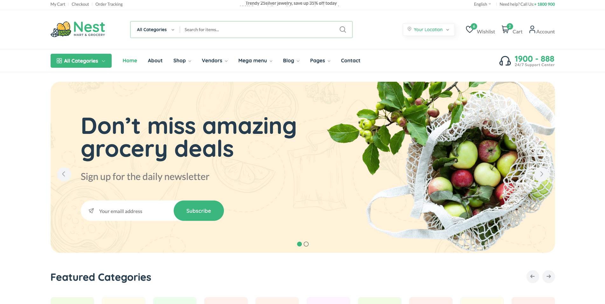
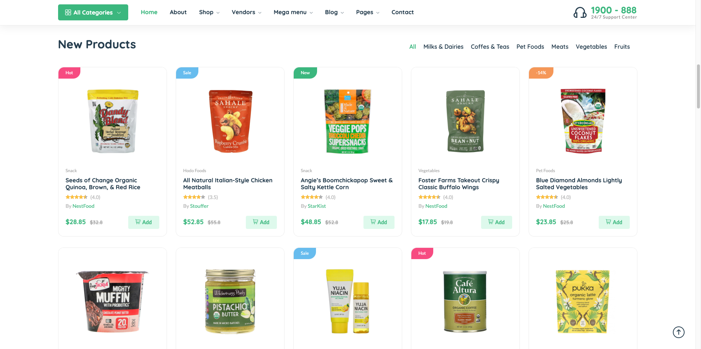
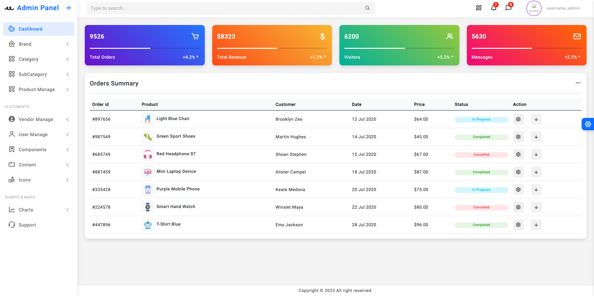
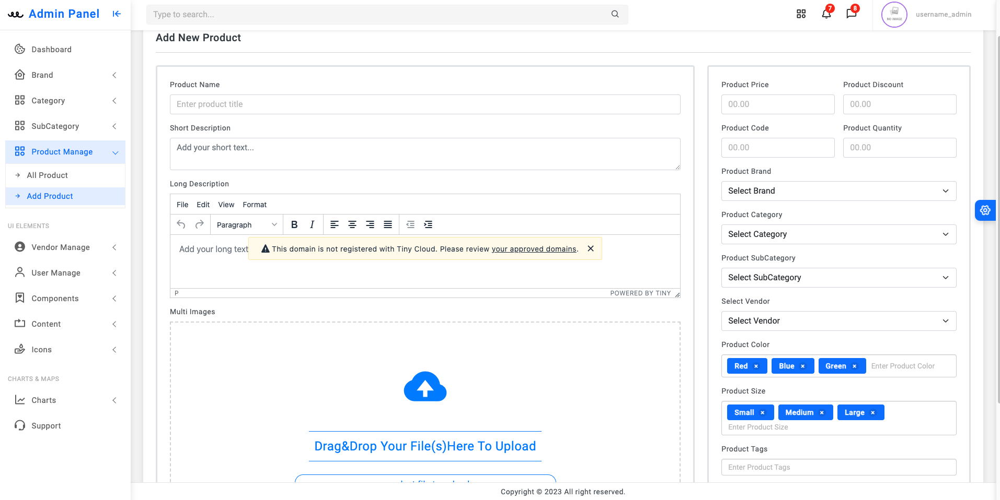
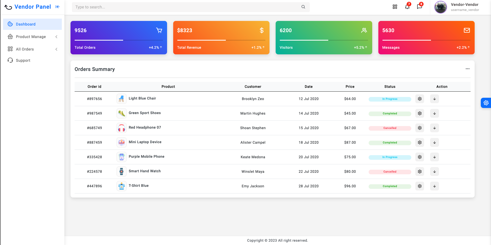

## About mecom e-commerce online shop Project

Creating a personal e-commerce project based on the Laravel framework. The philosophy behind this project is to control everything with an Admin panel and vendor panel

The website uses mainly Laravel including HTML, CSS and JavaScript, jQuery for the most frontend functionality, and MySQL for database

The main area of the e-commerce project

The user panel

The admin dashboard controls all the shop

The Vendor dashboard has been approved by the admin

More images and processes will updated daily
